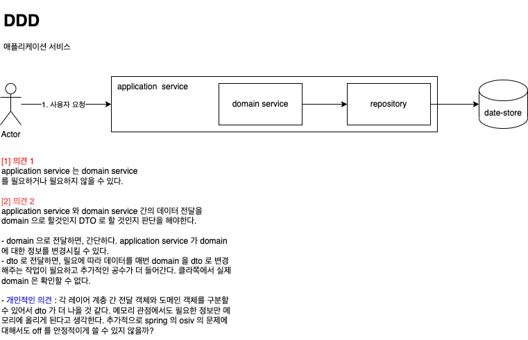
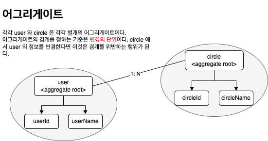

# 도메인 주도 설계 철저 입문 By Kotlin

## 지식을 표현하는 패턴
### chapter02 : 💁 __값 객체 (Value Object)__
* Equality 로 비교된다. (내부적인 값의 속성을 비교한다.)
* 불변 특성이 있다.
* 값의 변경은 새로운 값 객체의 생성이 된다.

### chapter03: 💁 __엔티티 (Entity)__
* Identity 로 비교된다. (별도의 식별자가 있다.)
* 가변 특성이 있다.

> 값 객체와 엔티티 간의 구분을 어떻게 하는 것이 좋은가?   
> 생애주기의 존재여부 및 생애주기의 연속성이 있다면 엔티티로 처리하는게 좋다.
> 그 외에는 값 객체로 남겨두는 것이 좋다.

* 생애주기의 존재여부
  * 객체가 태어나서 죽는 경우가 있음을 의미, 시스템 내의 도메인의 정보가 사용되었다가 이후에 사라짐 CREATE/DELETE
* 생애주기의 연속성
  * 생애주기가 계속 반복되는가를 의미, 태어나고 죽고 태어나고 죽고를 반복

> 값 객체도 될 수 있고 엔티티가 될 수있는 모델이 있는 경우   
> 환경에 따라 달라질 수 있으니 충분히 고민을 해봐야 함 (경험적으로 많이 겪어봐야 알 듯)

### chapter04 : 💁 __도메인 서비스__
* 값 객체로 모든 행동을 구현하지 않고, 별도의 객체로 분리해서 정의할 수 있도록 한다. (별도의 객채 = 도메인 서비스)
  * 도메인 서비스는 값 객체와 엔티티에서 구현되는 `부자연스러움` 을 해결해준다.
* 도메인 서비스는 별도의 상태값은 가지지 않는다.
* DDD 에서는 서비스는 두가지 맥락으로 구분된다.
  * 도메인을 위한 서비스
  * 애플리케이션을 위한 서비스
* 도메인 서비스에서 구현할 지 망설여진다면 우선 `엔티티나 값 객체에 정의해본다.`

## 애플리케이션을 구성하는 패턴
### chapter05 : 💁 __레파지토리__
* 레파지토리 책임은 객체의 퍼시스턴시까지다.
  * 레파지토리의 책임이 도메인 규칙에 가깝게 책임을 가지고 있는지 살펴야 한다.
  * 레파지토리와 도메인 서비스 책임 둘 중에 `행위` 가 어디에 더 가까운지 알아야 한다.

### chapter06 : 💁 __애플리케이션 서비스__   
   
  
* `api` -> `application-service` -> `domain-service` -> `repository` -> `data-store`
  * application-service 에서 여러 domain-service 의 내용들을 머지해서 내려주도록 해야한다.
  * 애플리케이션 서비스에 대한 응집도를 낮출수도 혹은 높일수도 있다.
    * 응집도를 낮춘다면,
      * UserApplicationService (유저 등록/탈퇴/수정 을 모두 다 한다.)
    * 응집도를 높인다면, (패키지로 응집도 높인 클래스를 구분한다. application.users.*)
      * UserApplicationRegisterService
      * UserApplicationDeleteService
      * UserApplicationUpdateService
    
#### 스프링의 `@Service` 애노테이션을 보면 아래와 같은 내용이 있다.
> Indicates that an annotated class is a "Service",    
> originally defined by Domain-Driven Design (Evans, 2003) as "an operation offered as an interface that stands alone in the model,    
> with no encapsulated state."   
> 
> May also indicate that a class is a "Business Service Facade" (in the Core J2EE patterns sense), or something similar.    
> This annotation is a general-purpose stereotype and individual teams may narrow their semantics and use as appropriate.   
* 도메인 모델에서 별도의 캡슐화된 상태값 없이 독립적인 형태로 작업을 제공한다.
* 또 비즈니스 서비스 의 facade 형태로 혹은 이와 유사하게 나타낼 수 있다. 블라블라블라
* 개인적으로 `Service` 애노테이션을 결과적으로 사용하기에 따라 애플리케이션 서비스 혹은 도메인 서비스로 사용할 수 있지 않을까?? 싶다.
  * 따라서, 나는 구분해서 사용하기위해 별도의 메타애노테이션을 정의했다.
```kotlin
/**
 * 도메인과 레파지토리에 밀접한 도메인 서비스 애노테이션이다.
 * 도메인 서비스끼리는 서로 호출하지 않는게 핵심이다.
 */
@Service
@Target(AnnotationTarget.TYPE, AnnotationTarget.CLASS)
@Retention(AnnotationRetention.RUNTIME)
annotation class DomainService(
    @get:AliasFor(annotation = Service::class, attribute = "value")
    val value: String = ""
)

/**
 * 사용자 유스케이스에 대한 전용 애플리케이션 서비스 애노테이션이다.
 */
@Service
@Target(AnnotationTarget.TYPE, AnnotationTarget.CLASS)
@Retention(AnnotationRetention.RUNTIME)
annotation class ApplicationService(
    @get:AliasFor(annotation = Service::class, attribute = "value")
    val value: String = ""
)
```

### chapter07 : 💁 __소프트웨어 유연성을 위한 의존관계__
* DIP 를 이용해 해결한다. (의존관계 역전 원칙)
* 스프링 프레임워크에서는 IoC 컨테이너를 구현하여, DI (의존관계 역전) 을 구행하고 있다.
  * https://docs.spring.io/spring-framework/docs/current/reference/html/core.html#beans-introduction
* 기타 다른 책들 (오브젝트와 클린코드) 에서도 관련 내용을 언급하고 있다.
  * https://github.com/coding-buddha/object-by-kotlin/blob/main/README-object.md
  * https://github.com/pasudo123/mango-banana-clean-code/blob/master/README.md

### chapter08 : 💁 __소프트웨어 시스템 구성하기__
* 프론트엔드에서 들어오는 데이터를 전달하는 객체와 애플리케이션 서비스의 행동을 실행하기 위한 객체는 엄연히 용도가 다르다. 
* 특별한 이유가 없는 한 이런 식으로 객체를 재사용하는 것은 좋지 않다.
  
### chapter09 : 💁 __팩토리__
* 팩토리를 이용해 객체 생성 절차를 캡슐화하는 것도 로직의 의도를 더 명확히 드러내면서 유연성을 확보할 수 있는 좋은 방법이다.

### chapter12 : 💁 __어그리게이트__ ⭐️⭐️
   

* 어그리게이트는 경계와 루트를 갖는다.
  * 어그리게이트 경계, 어그리게이트에 포함되는 대상을 결정하는 경계
  * 어그리게이트 루트, 어그리게이트에 포함되는 특정한 객체
* __외부에서 어그리게이트를 다루는 조작은 모두 루트를 거쳐야 한다.__
* 리포지토리는 애그리게이트마다 하나씩 만든다.
* 식별자를 이용한 컴포지션 `개인적으로 신선하다고 느낀다.`
  * User 와 Circle 의 관계가 N : 1 이라고 하였을 때, 아래와 같이 작성하는 것을 뜻한다.
  
> USER 를 인스턴스로 갖지 않고 식별자로 가지는 것을 뜻한다.   
> 아래의 내용과 같이 작성한다면 애그리게이트 경계를 넘어서는(Circle 이 User 의 데이터를 건드리는) 일은 없을 것 이다.   
> 추가적으로 메모리를 절약하는 방법의 일종이 될 것이다.
```kotlin
// Circle
class Circle(
  val name: String
) {

  val id: String = UUID.randomUUID().toString().replace("-", "")

  // 식별자를 이용한 컴포지션이다.
  val userIds: MutableList<String> = mutableListOf()
}

// User
class User(
    val name: String
) {

    val id: String = UUID.randomUUID().toString().replace("-", "")
}
```

### chapter13 : 💁 __복잡한 조건을 나타내기 위한 '명세'__
* 도메인에는 도메인 규칙이 적용되어야 한다
  * 하지만 도메인 규칙이 다른 어그리게이트 루트를 통해서 규칙이 정의되어야만 하는 경우가 있다.
  * 이러한 경우에 우리는 명세를 사용할 수 있다.
    * 명세는 애플리케이션 서비스에서 객체를 만들어 호출될 수 있다.
    * __나의 의견__ : `추가적으로 도메인 규칙으로 설정되니, 애플리케이션 뒷단의 도메인 서비스에서 설정해볼 수 있지 않을까?`

  
